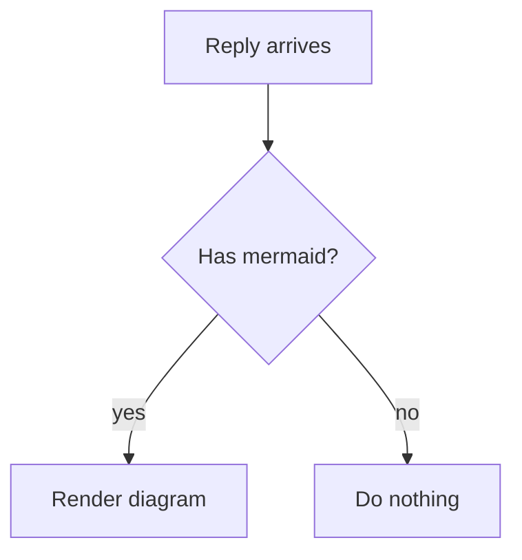

# mermaid-for-claude

A Claude Code plugin that renders the ```mermaid blocks in a reply as text diagrams, right below the reply, inside the terminal. 100% local: no network, no browser, no `npm install`. Node 20+ is the only requirement.

## Why this exists

When Claude Code writes a mermaid block, the terminal prints the raw source. You read `A --> B` lines instead of a diagram. Skills work around it by forbidding mermaid or by asking the model to hand-draw ASCII art, which is slow, inconsistent and often wrong. The only way to see the diagram was to leave the terminal for a browser.

This plugin closes that gap. The model keeps writing mermaid, the reader keeps working in the terminal, and the diagram appears where the reply is.

## What it looks like

Claude writes:

````

````

The terminal shows, under the reply:

```
mermaid-for-claude: diagram 1/1 (flowchart)
┌──────────────┐
│Reply arrives │
└───────┬──────┘
        │
        │
        ▼
◇──────────────◇
│ Has mermaid? ├─────────┐
◇───────┬──────◇        no
       yes               │
        │                │
        ▼                ▼
┌──────────────┐   ┌──────────┐
│Render diagram│   │Do nothing│
└──────────────┘   └──────────┘
```

A user journey:

```
mermaid-for-claude: diagram 1/1 (journey)
Reader sees a diagram in the terminal

Reply arrives
  Claude writes a mermaid block         ●●●○○  3  Claude
  Stop hook fires                       ●●●●●  5  Plugin
  Bundle renders the block              ●●●●○  4  Plugin
Reader looks
  Raw fence shown above the diagram     ●●○○○  2  Reader
  Diagram shown in the Stop says block  ●●●●●  5  Reader, Plugin
```

A git graph:

```
mermaid-for-claude: diagram 1/1 (gitGraph)
main
●
●
├─┐    branch develop
│ ●
│ ●
● │
◆─┘    merge develop
●
├───┐  branch hotfix
│   ⊗
●   │  cherry-pick abc123
◆───┘  merge hotfix [v1.0.1]
```

## Install

This repo is its own plugin marketplace. Three steps, inside Claude Code:

1. Add the marketplace:

   ```
   /plugin marketplace add lucaswx2/mermaid-for-claude
   ```

2. Install the plugin:

   ```
   /plugin install mermaid-for-claude@mermaid-for-claude
   ```

3. Start a new session. The plugin tells the model at session start that diagrams render here, so the first reply of the new session already knows.

To check it works, ask Claude for a small flowchart. The diagram appears in a dim `Stop says:` block under the reply.

From a terminal instead of a session, the same two commands are `claude plugin marketplace add lucaswx2/mermaid-for-claude` and `claude plugin install mermaid-for-claude@mermaid-for-claude`.

### Requirements

- Node 20 or newer on `PATH`. With no Node, a reply with a diagram gets one notice telling you so, and nothing else changes.
- Bash. Claude Code already runs hooks through bash on every platform, Git Bash on Windows.
- Windows only, optional: the .NET Framework `csc.exe` that ships with Windows. The plugin compiles a tiny console probe with it once, so diagrams can follow the live width of your terminal. Without it, diagrams fit the width measured at session start, then 120 columns.

## What renders

Seventeen diagram types render well and the model is told to prefer them:

| Renderer | Types |
| --- | --- |
| Baseline, [beautiful-mermaid](https://github.com/lukilabs/beautiful-mermaid) bundled | flowchart, sequenceDiagram, stateDiagram-v2, classDiagram, xychart-beta |
| Built in, written here as rows, bars and trees | pie, gitGraph, mindmap, journey, timeline, kanban, packet, radar, gantt, quadrantChart, block, treemap |

`erDiagram` renders roughly. `requirementDiagram`, C4, `sankey`, `architecture` and `zenuml` need a two-dimensional layout engine to keep their point, so they print a one-line notice instead of a diagram.

## Configuration

Three environment variables. No config file.

| Variable | Effect |
| --- | --- |
| `MERMAID_FOR_CLAUDE_ASCII=1` | Draw with ASCII only (`+ - \|`, `#`, `*`) instead of box-drawing glyphs. |
| `MERMAID_FOR_CLAUDE_MAX_WIDTH=<columns>` | Fixed width limit. Overrides the live terminal width. |
| `MERMAID_FOR_CLAUDE_DISABLE=1` | Switch both hooks off without uninstalling. |

## How it behaves

- **Width.** Diagrams fit the width of the terminal window you have open, minus the indent of the `Stop says:` block, read on every reply. A baseline diagram wider than that becomes a notice; built-in renderers fit themselves inside it.
- **Output budget.** One reply may add at most 9,800 characters of diagrams and notices. A diagram that does not fit the remaining budget becomes a notice. Never a partial diagram, never a file.
- **Render deadline.** 3 seconds per diagram, 7 seconds per reply. A slow diagram becomes a notice and the next one is still tried.
- **Notices.** One line each, under the same header as a diagram: unsupported type, unsupported line, too wide, over budget, over the deadline, Node missing.
- **Safety.** The reply is never evaluated. Nothing is written under the plugin folder. The hooks never exit non-zero and never block a reply. The only file the plugin writes is a small per-session width cache under your Claude config directory (`~/.claude/mermaid-for-claude`), swept after a week.

The live terminal width is verified on Windows. On macOS and Linux it reads `/dev/tty`; that path runs in CI without a terminal, so it is known not to break, but nobody has confirmed the number on a real Unix terminal yet. If you do, please open an issue with what you saw.

## How it was built

This plugin was vibe-coded with [Claude Code](https://claude.com/claude-code), end to end, following [Matt Pocock's skills workflow](https://github.com/mattpocock/skills): a wayfinder map broke the fog into research, grilling and prototype tickets; each decision landed as an ADR in `docs/adr/`; the map collapsed into a spec, the spec into tickets, and each ticket was implemented test-first by an agent, reviewed, and merged as a pull request. The GitHub issues are the full record of every decision, and `CONTEXT.md` is the glossary the code and the docs share.

That means the code is thorough where the process was thorough, and blind where nobody had a machine to look: the Unix width path above is the honest example. Read the ADRs before changing behaviour; they say why things are the way they are.

## Contributing

Contributions are welcome, from a typo to a new renderer. The project is small enough to read in an afternoon.

- **Found a diagram that renders badly?** Open an issue with the mermaid source and what you saw. That is the most useful thing you can send.
- **Want to add a renderer** for one of the notice-only types, or improve an existing one? Look at `src/renderers/` and the snapshots in `test/snapshots/`. Every renderer draws with rows, bars and trees, takes the width limit as input, and gives a notice for any line outside its grammar subset.
- **On macOS or Linux?** Confirming the live width through `/dev/tty` is a five-minute check nobody has done yet.

Working on it:

```
npm ci
npm run build       # rebuilds dist/, which is committed
npm run typecheck
npm test            # end to end through the real hook scripts
```

Tests drive the hook scripts the way Claude Code does, through `test/seams/stop-hook.mjs`; nothing imports a renderer directly. CI runs on Ubuntu, Windows and macOS with Node 20 and 24 and checks that `dist/` matches the source. Conventions live in `CLAUDE.md`, the glossary in `CONTEXT.md`, and the agent-facing process docs in `docs/agents/`. Issues labelled `ready-for-agent` are scoped for an agent to pick up.

## Uninstall

```
/plugin uninstall mermaid-for-claude@mermaid-for-claude
```

Or set `MERMAID_FOR_CLAUDE_DISABLE=1` to keep it installed and silent.

## License

MIT.
